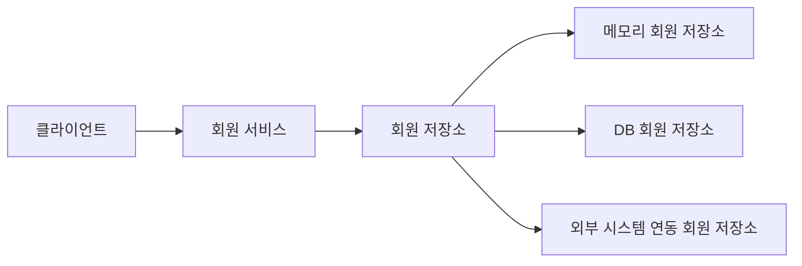
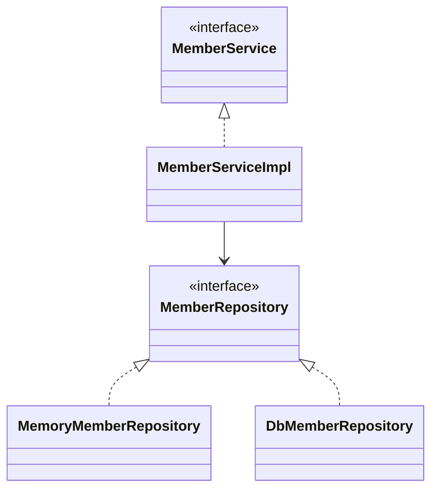

# 📌 회원 도메인 설계

## 1. 요구사항

- 회원을 가입하고 조회할 수 있다.
- 회원은 일반과 VIP 두 가지 등급이 있다.
- 회원 데이터는 자체 DB를 구축할 수 있고, 외부 시스템과 연동할 수 있다.(미확정)

---

## 2. 전체 흐름

클라이언트 → 회원 서비스 → 회원 저장소

- 회원 서비스는 회원 가입 및 조회를 담당한다.
- 회원 저장소는 실제 데이터 저장 역할을 한다.

---

## 3. 설계 구조

### 3.1 서비스 계층

- `MemberService` (인터페이스)
- `MemberServiceImpl` (구현체)

👉 역할:
- 회원 가입
- 회원 조회

---

### 3.2 저장소 계층

- `MemberRepository` (인터페이스)
- `MemoryMemberRepository` (메모리 구현)
- `DbMemberRepository` (DB 구현)

👉 특징:
- 인터페이스 기반 설계
- 구현체 교체 가능

---

## 4. 다이어그램

## 회원 도메인 협력 관계

---

## 회원 클래스 다이어그램

---

## 회원 객체 다이어그램

